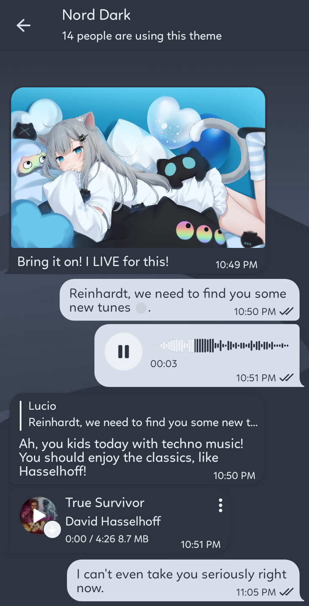
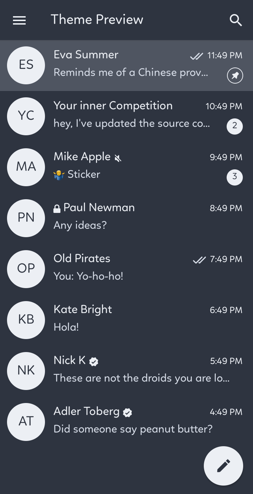
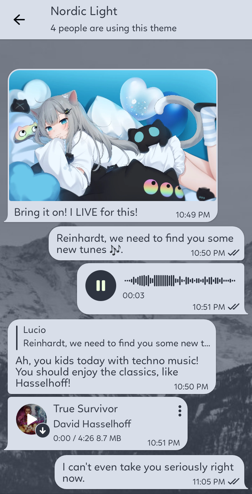
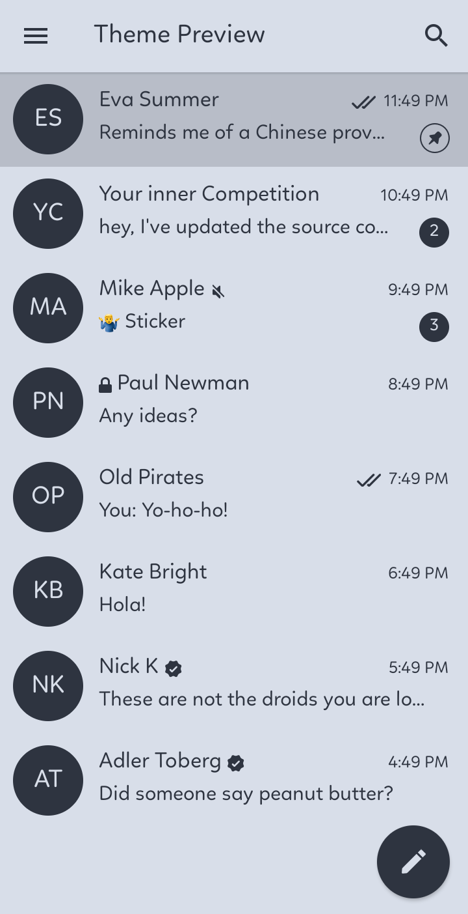

# Nord Theme for Telegram Android/IOS

[Nord Theme](https://nordtheme.com) for [Telegram Desktop](https://github.com/gilbertw1/telegram-nord-theme) is already available. So, why not make one for Android and IOS?

# Features:
>Made from pure [Nord Theme](https://nordtheme.com).

>Light and Dark mode available

>Compatible for both Android and IOS

# Screenshots:
Dark Mode:

Light Mode:

# Apply/Preview:
[Dark Version](https://t.me/addtheme/nord_dark_kde)

[Light Version](https://t.me/addtheme/nordic_light_kde)

I will release more versions soon like Dark with Dark sent color and Light with Dark sent color.

Message me on Telegram for suggestions [@detective_ryuzaki](https://t.me/detective_ryuzaki). I will try to keep this theme alive.
